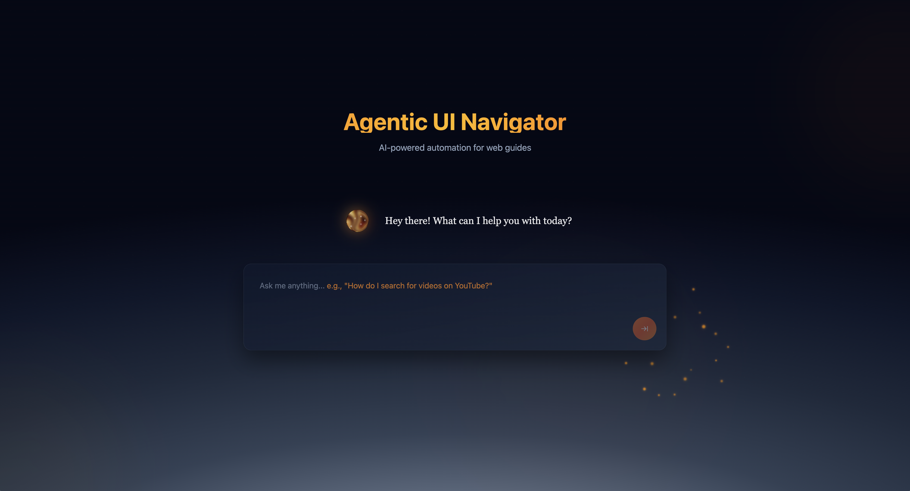

# Agentic UI Navigator

AI-powered browser automation that generates step-by-step visual guides for any web application. Simply ask how to perform a task, and the system automatically navigates the app, captures screenshots, and creates a workflow guide.



## Getting Started

### 1. Install Dependencies

```bash
# Backend
python3 -m venv venv
source venv/bin/activate
pip install -r requirements.txt

# Frontend
cd frontend
npm install --legacy-peer-deps
```

### 2. Configure API Key

```bash
echo "OPENAI_API_KEY=sk-your-key-here" > .env
```

### 3. Run the Application

**Terminal 1 - Backend:**
```bash
source venv/bin/activate
python server.py
```

**Terminal 2 - Frontend:**
```bash
cd frontend
npm run dev
```

Open **http://localhost:3000** in your browser.

## Example Usage

Ask questions like:
- *"How do I search for videos on YouTube?"*
- *"How to star a repository in GitHub?"*
- *"How do I create a project in Linear?"*

The system will automatically navigate, capture screenshots, and generate a guide in `dataset/{app}/{task}/`.

## Technical Details

- **Backend**: FastAPI (port 8000) with [Browser Use](https://github.com/browser-use/browser-use) framework
- **Frontend**: Next.js (port 3000)
- **AI**: GPT-4o with vision for intelligent navigation
- **Output**: Screenshots + Markdown guides in `dataset/` folder

## Requirements

- Python 3.8+
- Node.js 18+
- OpenAI API key
