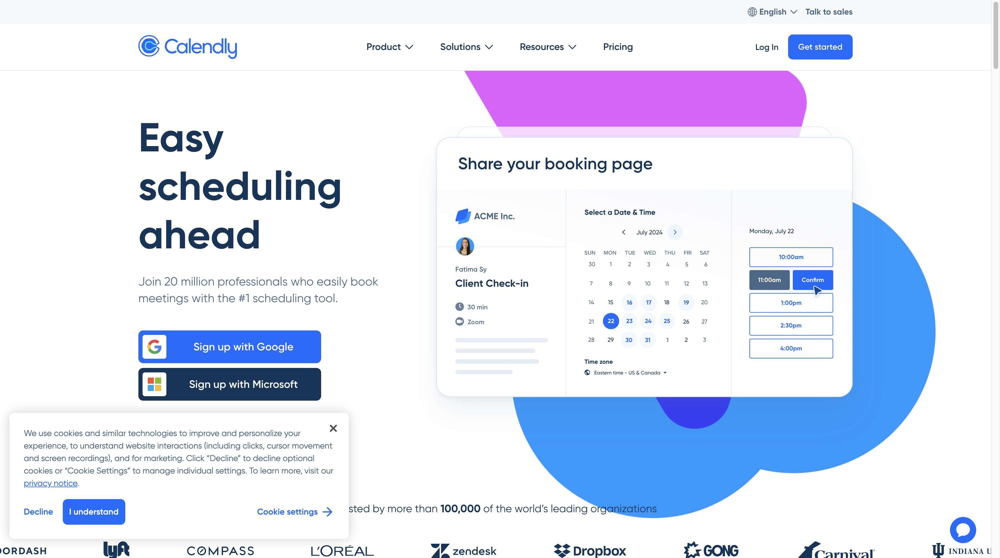

# Schedule A Meeting

## Task Query
schedule a meeting

## Application
Calendly

## Workflow Steps

This workflow captures 2 distinct UI states:

### Step 1: BrowserStateHistory(url='https://calendly.com', title='Initial Actions', tabs=[], interacted_element=[None], screenshot_path=None)

**Action:** [ActionResult(is_done=False, success=None, error=None, attachments=None, long_term_memory='Found initial url and automatically loaded it. Navigated to https://calendly.com', extracted_content='🔗 Navigated to https://calendly.com', include_extracted_content_only_once=False, metadata=None, include_in_memory=False)]

---

### Step 2: BrowserStateHistory(url='https://calendly.com/', title='Free Online Appointment Scheduling Software | Calendly', tabs=[TabInfo(url='https://calendly.com/', title='Free Online Appointment Scheduling Software | Calendly', target_id='89A8979CFF04CB633C81F7AA32975868', parent_target_id=None)], interacted_element=[None], screenshot_path='/var/folders/g1/573ndn_10n1725bppbrkwyfr0000gn/T/browser_use_agent_06916662-06c7-7dc3-8000-67ede25b1b91_1763075616/screenshots/step_1.png')

**Action:** [ActionResult(is_done=True, success=False, error=None, attachments=[], long_term_memory="Task completed: False - I have navigated to https://calendly.com. The page presents options to 'Log In' or 'Sign up', indica - 122 more characters", extracted_content="I have navigated to https://calendly.com. The page presents options to 'Log In' or 'Sign up', indicating that authentication is required to proceed with scheduling a meeting. As per instruction #2, I must stop immediately.", include_extracted_content_only_once=False, metadata=None, include_in_memory=False)]

---

## Metadata

- **Captured:** 2025-11-13T18:13:45.680601
- **Total States:** 2
- **App:** calendly

