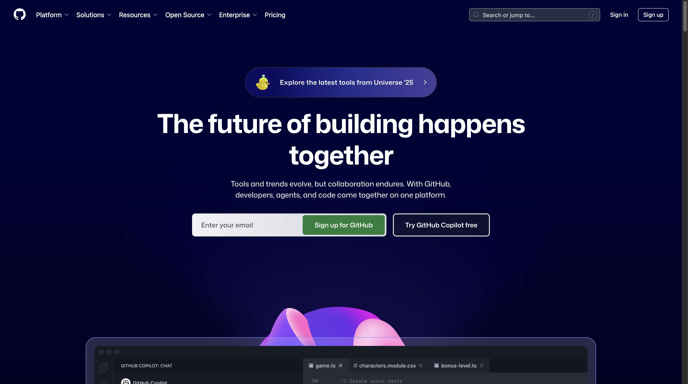
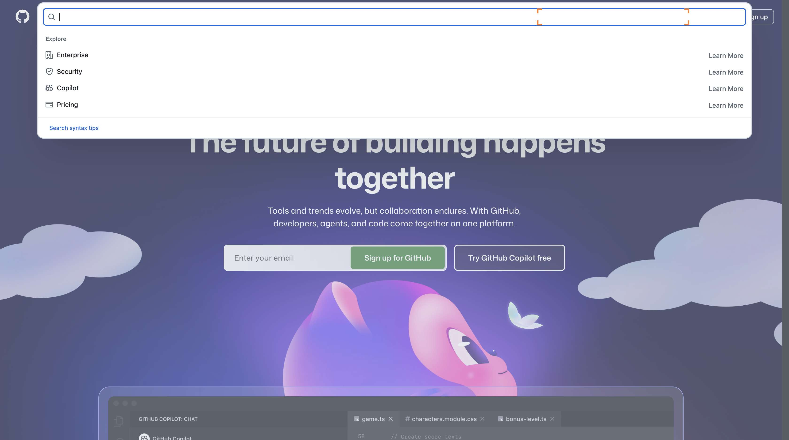
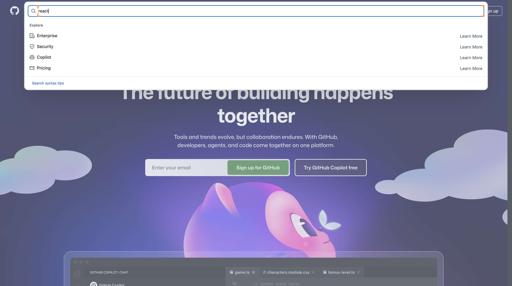
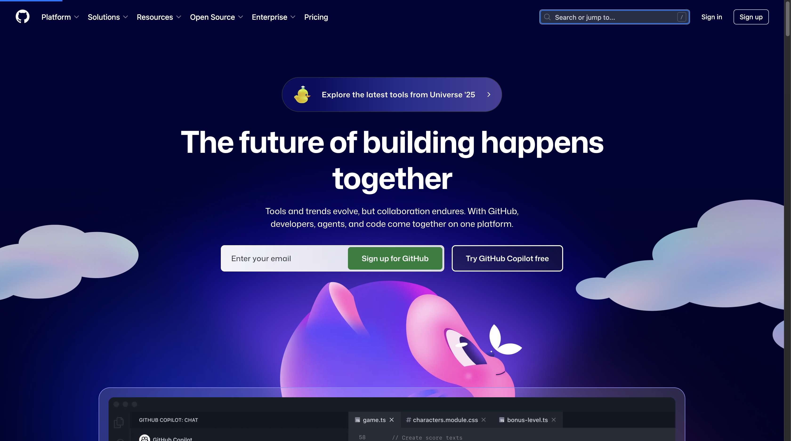
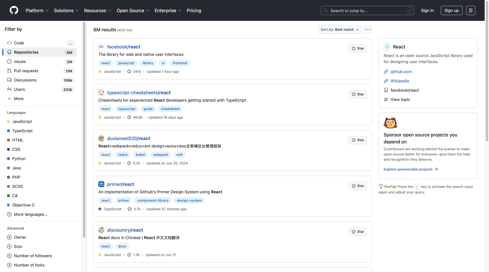
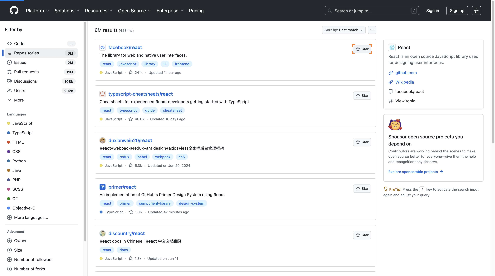
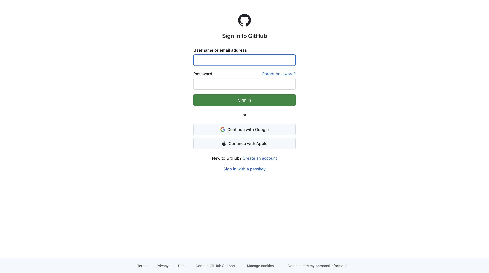

# Star A Repository

## Task Query
star a repository

## Application
Github

## Workflow Steps

This workflow captures 8 distinct UI states:

### Step 1: BrowserStateHistory(url='https://github.com', title='Initial Actions', tabs=[], interacted_element=[None], screenshot_path=None)

**Action:** [ActionResult(is_done=False, success=None, error=None, attachments=None, long_term_memory='Found initial url and automatically loaded it. Navigated to https://github.com', extracted_content='🔗 Navigated to https://github.com', include_extracted_content_only_once=False, metadata=None, include_in_memory=False)]

---

### Step 2: BrowserStateHistory(url='https://github.com/', title='GitHub · Change is constant. GitHub keeps you ahead. · GitHub', tabs=[TabInfo(url='https://github.com/', title='GitHub · Change is constant. GitHub keeps you ahead. · GitHub', target_id='9EF0EAF47356F8F8FAD2DAB87C758098', parent_target_id=None)], interacted_element=[DOMInteractedElement(node_id=569, backend_node_id=1124, frame_id=None, node_type=<NodeType.ELEMENT_NODE: 1>, node_value='', node_name='BUTTON', attributes={'type': 'button', 'class': 'header-search-button placeholder input-button form-control d-flex flex-1 flex-self-stretch flex-items-center no-wrap width-full py-0 pl-2 pr-0 text-left border-0 box-shadow-none', 'data-target': 'qbsearch-input.inputButton', 'aria-label': 'Search or jump to…', 'aria-haspopup': 'dialog', 'placeholder': 'Search or jump to...', 'data-hotkey': 's,/', 'autocapitalize': 'off', 'data-analytics-event': '{"location":"navbar","action":"searchbar","context":"global","tag":"input","label":"searchbar_input_global_navbar"}', 'data-action': 'click:qbsearch-input#handleExpand'}, bounds=DOMRect(x=1146.7109375, y=21.0, width=318.0, height=30.0), x_path='html/body/div[1]/div[3]/header/div/div[2]/div/div/qbsearch-input/div[1]/button', element_hash=3605852457832135930)], screenshot_path='/var/folders/g1/573ndn_10n1725bppbrkwyfr0000gn/T/browser_use_agent_06916572-fe64-7df4-8000-38ba8930c374_1763071791/screenshots/step_1.png')

**Action:** [ActionResult(is_done=False, success=None, error=None, attachments=None, long_term_memory=None, extracted_content='Clicked button "Search or jump to..." aria-label=Search or jump to…', include_extracted_content_only_once=False, metadata={'click_x': 1305.7109375, 'click_y': 36.0}, include_in_memory=False)]

---

### Step 3: BrowserStateHistory(url='https://github.com/', title='GitHub · Change is constant. GitHub keeps you ahead. · GitHub', tabs=[TabInfo(url='https://github.com/', title='GitHub · Change is constant. GitHub keeps you ahead. · GitHub', target_id='9EF0EAF47356F8F8FAD2DAB87C758098', parent_target_id=None)], interacted_element=[DOMInteractedElement(node_id=3067, backend_node_id=7, frame_id=None, node_type=<NodeType.ELEMENT_NODE: 1>, node_value='', node_name='INPUT', attributes={'id': 'query-builder-test', 'name': 'query-builder-test', 'value': '', 'autocomplete': 'off', 'type': 'text', 'role': 'combobox', 'spellcheck': 'false', 'aria-expanded': 'true', 'aria-describedby': 'validation-748e6144-c535-48cd-a983-f1112dfc60e7', 'data-target': 'query-builder.input', 'data-action': '\n          input:query-builder#inputChange\n          blur:query-builder#inputBlur\n          keydown:query-builder#inputKeydown\n          focus:query-builder#inputFocus\n        ', 'data-view-component': 'true', 'class': 'FormControl-input QueryBuilder-Input FormControl-medium focus-visible', 'aria-controls': 'query-builder-test-results', 'aria-autocomplete': 'list', 'aria-haspopup': 'listbox', 'style': 'width: 300px;', 'data-focus-visible-added': ''}, bounds=DOMRect(x=126.0, y=20.0, width=1460.0, height=32.0), x_path='html/body/div[1]/div[3]/header/div/div[2]/div/div/qbsearch-input/div[1]/div/modal-dialog/div/div/div/form/query-builder/div[1]/div[1]/div/div[2]/input', element_hash=5943486623494701297)], screenshot_path='/var/folders/g1/573ndn_10n1725bppbrkwyfr0000gn/T/browser_use_agent_06916572-fe64-7df4-8000-38ba8930c374_1763071791/screenshots/step_2.png')

**Action:** [ActionResult(is_done=False, success=None, error=None, attachments=None, long_term_memory="Typed 'react'", extracted_content="Typed 'react'", include_extracted_content_only_once=False, metadata={'input_x': 856.0, 'input_y': 36.0}, include_in_memory=False)]

---

### Step 4: BrowserStateHistory(url='https://github.com/', title='GitHub · Change is constant. GitHub keeps you ahead. · GitHub', tabs=[TabInfo(url='https://github.com/', title='GitHub · Change is constant. GitHub keeps you ahead. · GitHub', target_id='9EF0EAF47356F8F8FAD2DAB87C758098', parent_target_id=None)], interacted_element=[None], screenshot_path='/var/folders/g1/573ndn_10n1725bppbrkwyfr0000gn/T/browser_use_agent_06916572-fe64-7df4-8000-38ba8930c374_1763071791/screenshots/step_3.png')

**Action:** [ActionResult(is_done=False, success=None, error=None, attachments=None, long_term_memory='Sent keys: Enter', extracted_content='Sent keys: Enter', include_extracted_content_only_once=False, metadata=None, include_in_memory=False)]

---

### Step 5: BrowserStateHistory(url='https://github.com/', title='GitHub · Change is constant. GitHub keeps you ahead. · GitHub', tabs=[TabInfo(url='https://github.com/', title='GitHub · Change is constant. GitHub keeps you ahead. · GitHub', target_id='9EF0EAF47356F8F8FAD2DAB87C758098', parent_target_id=None)], interacted_element=[None], screenshot_path='/var/folders/g1/573ndn_10n1725bppbrkwyfr0000gn/T/browser_use_agent_06916572-fe64-7df4-8000-38ba8930c374_1763071791/screenshots/step_4.png')

**Action:** [ActionResult(is_done=False, success=None, error=None, attachments=None, long_term_memory='Navigated to https://github.com/search?q=react', extracted_content='🔗 Navigated to https://github.com/search?q=react', include_extracted_content_only_once=False, metadata=None, include_in_memory=False)]

---

### Step 6: BrowserStateHistory(url='https://github.com/search?q=react&type=repositories', title='Repository search results · GitHub', tabs=[TabInfo(url='https://github.com/search?q=react&type=repositories', title='Repository search results · GitHub', target_id='9EF0EAF47356F8F8FAD2DAB87C758098', parent_target_id=None)], interacted_element=[DOMInteractedElement(node_id=11517, backend_node_id=8360, frame_id=None, node_type=<NodeType.ELEMENT_NODE: 1>, node_value='', node_name='A', attributes={'type': 'button', 'href': '/login?return_to=https%3A%2F%2Fgithub.com%2Fsearch%3Fq%3Dreact%26type%3Drepositories', 'class': 'prc-Button-ButtonBase-c50BI', 'data-loading': 'false', 'data-size': 'small', 'data-variant': 'default', 'aria-describedby': ':r3l:-loading-announcement'}, bounds=DOMRect(x=1198.078125, y=153.0, width=61.921875, height=28.0), x_path='html/body/div[1]/div[4]/main/react-app/div/div/div[1]/div/div/div[2]/div/div/div[1]/div[4]/div/div/div[1]/div/div[2]/div/a', element_hash=9106004477407553425)], screenshot_path='/var/folders/g1/573ndn_10n1725bppbrkwyfr0000gn/T/browser_use_agent_06916572-fe64-7df4-8000-38ba8930c374_1763071791/screenshots/step_5.png')

**Action:** [ActionResult(is_done=False, success=None, error=None, attachments=None, long_term_memory=None, extracted_content='Clicked a "Star"', include_extracted_content_only_once=False, metadata={'click_x': 1229.0390625, 'click_y': 167.0}, include_in_memory=False)]

---

### Step 7: BrowserStateHistory(url='https://github.com/search?q=react&type=repositories', title='Sign in to GitHub · GitHub', tabs=[TabInfo(url='https://github.com/search?q=react&type=repositories', title='Repository search results · GitHub', target_id='9EF0EAF47356F8F8FAD2DAB87C758098', parent_target_id=None)], interacted_element=[None], screenshot_path='/var/folders/g1/573ndn_10n1725bppbrkwyfr0000gn/T/browser_use_agent_06916572-fe64-7df4-8000-38ba8930c374_1763071791/screenshots/step_6.png')

**Action:** [ActionResult(is_done=False, success=None, error=None, attachments=None, long_term_memory=None, extracted_content='Requested screenshot for next observation', include_extracted_content_only_once=False, metadata={'include_screenshot': True}, include_in_memory=False)]

---

### Step 8: BrowserStateHistory(url='https://github.com/login?return_to=https%3A%2F%2Fgithub.com%2Fsearch%3Fq%3Dreact%26type%3Drepositories', title='Sign in to GitHub · GitHub', tabs=[TabInfo(url='https://github.com/login?return_to=https%3A%2F%2Fgithub.com%2Fsearch%3Fq%3Dreact%26type%3Drepositories', title='Sign in to GitHub · GitHub', target_id='9EF0EAF47356F8F8FAD2DAB87C758098', parent_target_id=None)], interacted_element=[None], screenshot_path='/var/folders/g1/573ndn_10n1725bppbrkwyfr0000gn/T/browser_use_agent_06916572-fe64-7df4-8000-38ba8930c374_1763071791/screenshots/step_7.png')

**Action:** [ActionResult(is_done=True, success=False, error=None, attachments=[], long_term_memory='Task completed: False - The attempt to star a repository on GitHub led to a login page. As per instruction 2, the task must  - 66 more characters', extracted_content='The attempt to star a repository on GitHub led to a login page. As per instruction 2, the task must stop immediately because login is required to complete the action.', include_extracted_content_only_once=False, metadata=None, include_in_memory=False)]

---

## Metadata

- **Captured:** 2025-11-13T17:10:19.089780
- **Total States:** 8
- **App:** github

