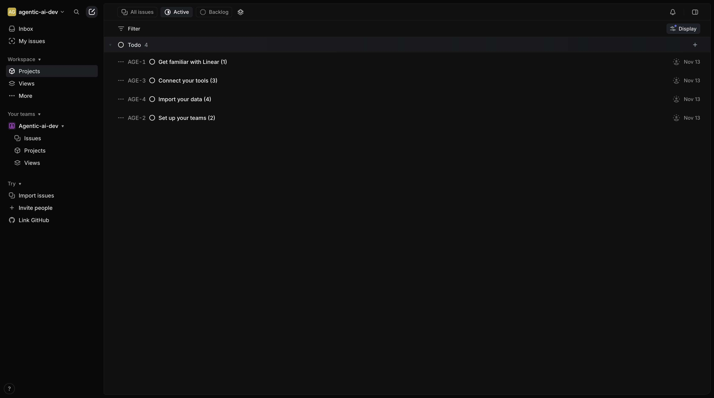
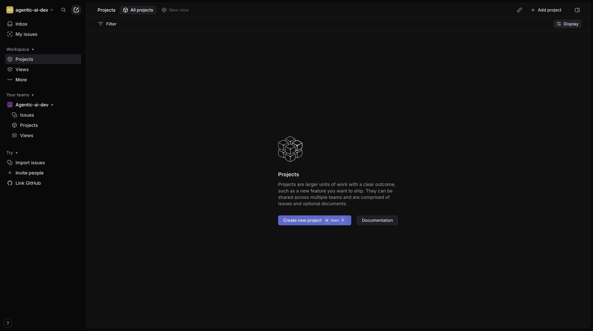
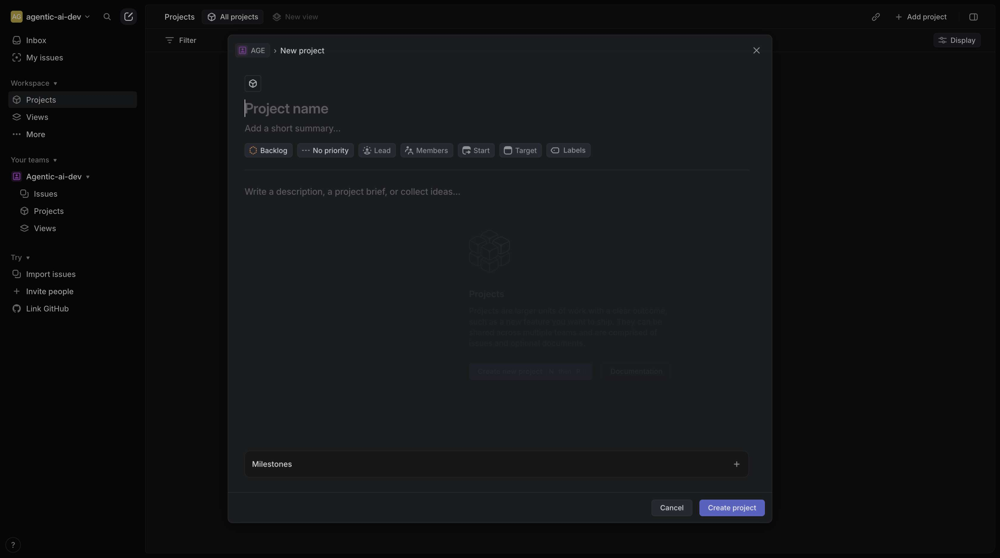
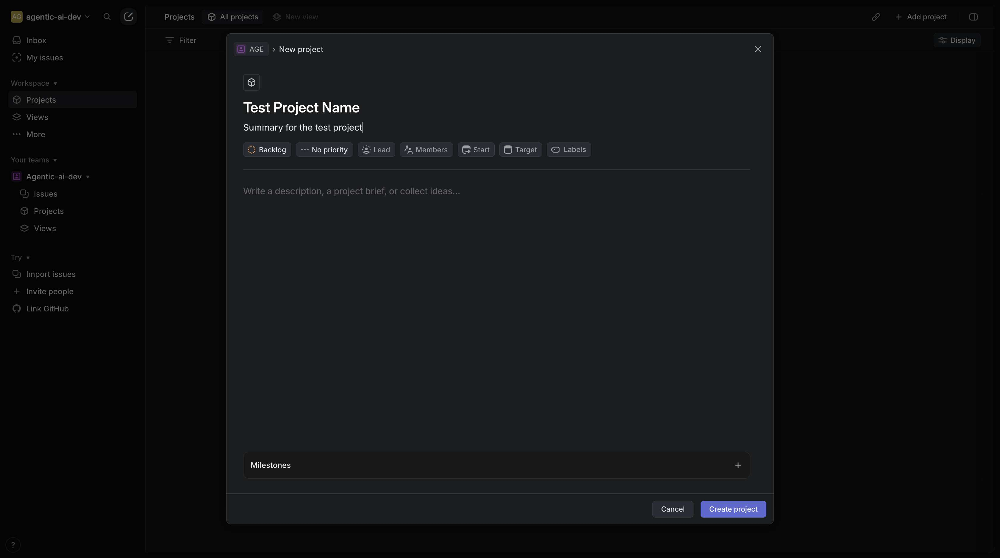

# Create A Project

**Application:** Linear

---

## Overview

This guide shows you how to **create a project** in Linear through 7 step-by-step screenshots.

## Steps

### 1. Open Linear.App',

_🔗 Navigated to https://linear.app_

---

### 2. Wait for Page Load

_Waited for 3 seconds_

---

### 3. Go to Projects

_Clicked div role=button "Projects"_

---

### 4. Wait for Page Load

_Waited for 3 seconds_

---

### 5. Click "Create New Project"

_Clicked the "Create New Project" button_

---

### 6. Enter "test project name"

_Entered: "test project name"_

---

### 7. Fill in Form

---

## Metadata

- **Captured:** 2025-11-17T14:20:45.857935
- **Total States:** 7
- **App:** linear

