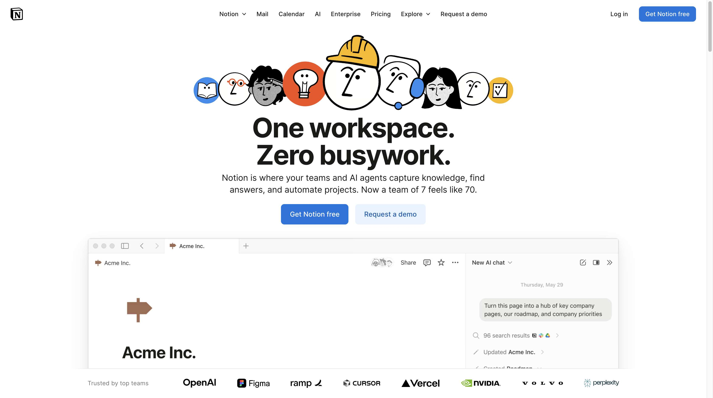
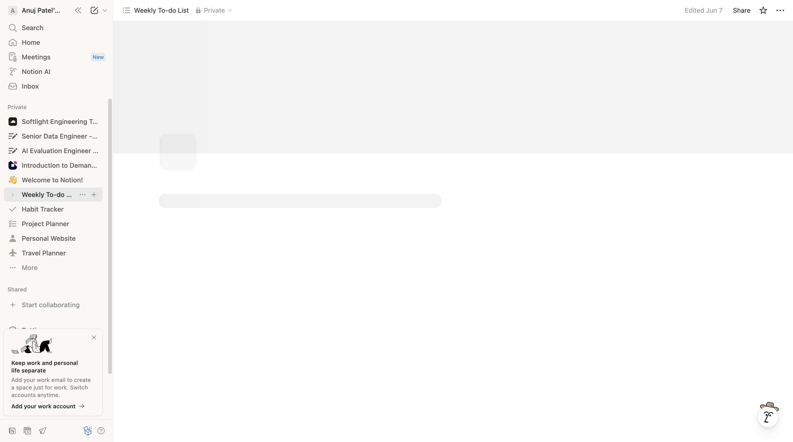
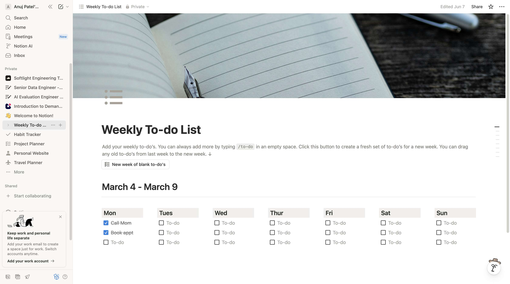
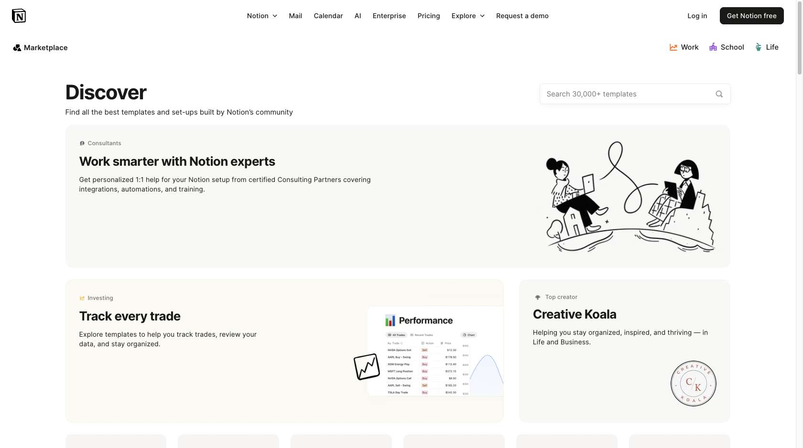
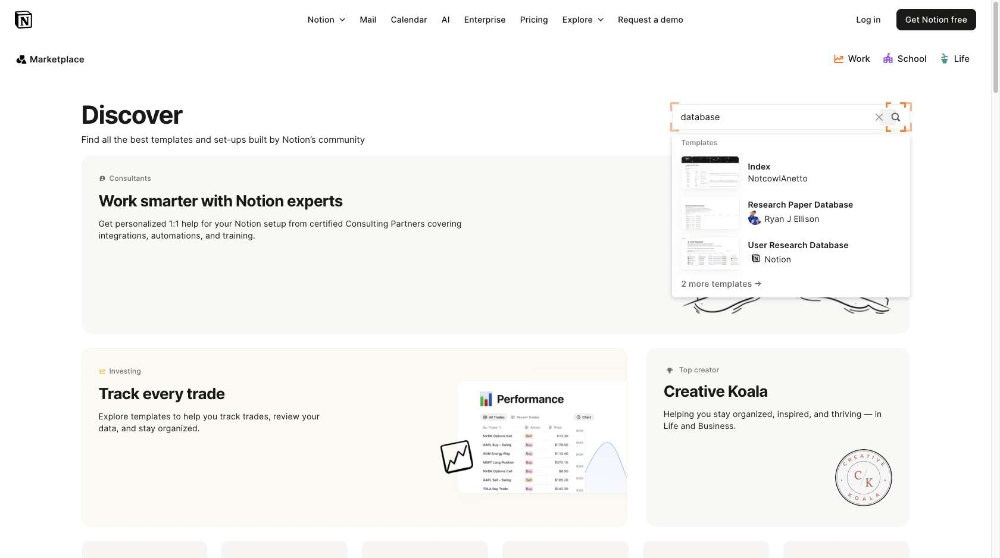
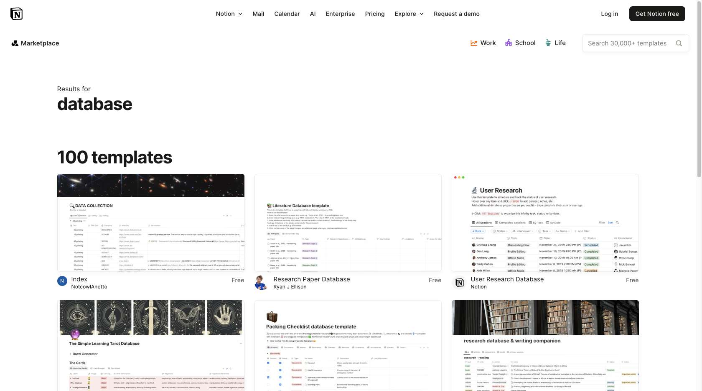
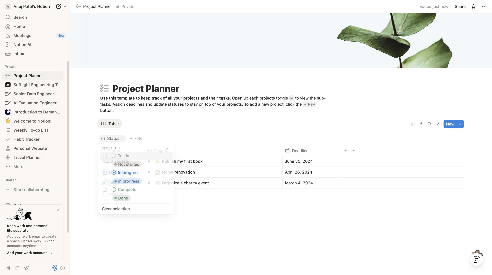
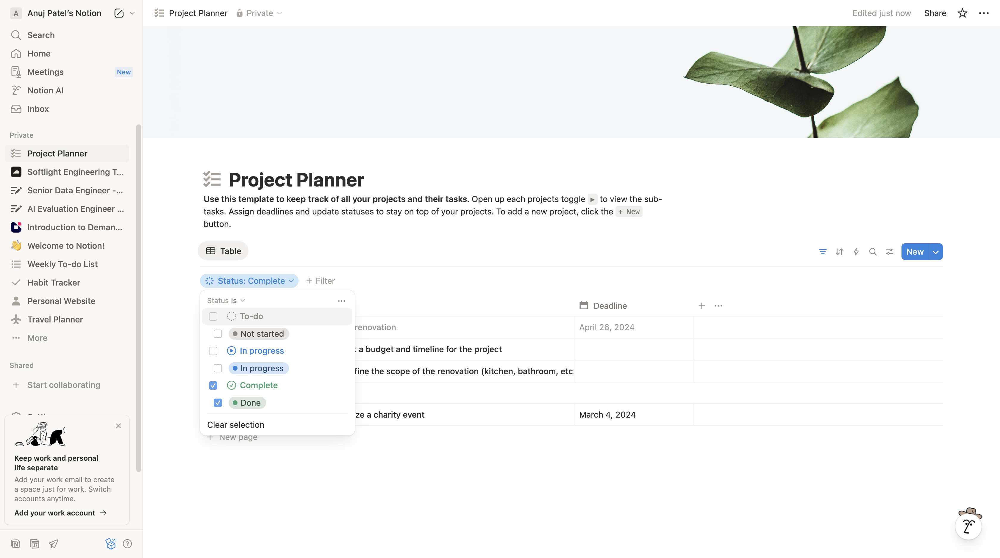

# Filter A Database

**Application:** Notion

---

## Overview

This guide shows you how to **filter a database** in Notion through 9 step-by-step screenshots.

## Steps

### 1. Open Notion.So',

_🔗 Navigated to https://www.notion.so_

---

### 2. Click Element

_Clicked a role=treeitem "Weekly To-do List"_

---

### 3. Scroll Page

_🔍 Scrolled down 938px_

---

### 4. Click Element

_Clicked a role=treeitem "Project Planner"_

---

### 5. Click Button

_Clicked div role=button aria-label=Filter_

---

### 6. Scroll Page

_🔍 Scrolled down 0.5 pages_

---

### 7. Click Element

_Clicked div role=option "Status" id=:r1p:_

---

### 8. Click Element

_Clicked div role=menuitem "Done" id=:r20:_

---

### 9. Navigate to Page

---

## Metadata

- **Captured:** 2025-11-17T10:22:09.540314
- **Total States:** 9
- **App:** notion

