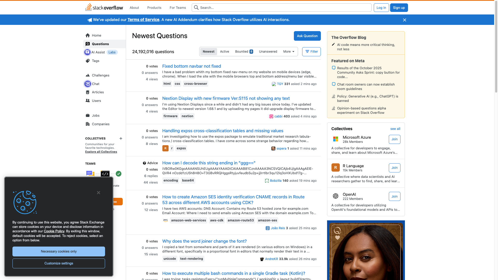
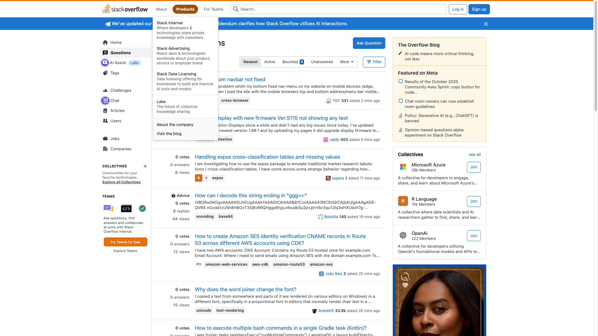

# Find Questions About Javascript

## Task Query
find questions about JavaScript

## Application
Stackoverflow

## Workflow Steps

This workflow captures 2 distinct UI states:

### Step 1: The current view is on the 'Newest Questions' page with a sidebar that includes navigation options.

**Action:** click

**Reasoning:** To find questions about JavaScript, navigating to the Tags section will allow filtering by the JavaScript tag.

---

### Step 2: The current view is on the 'Newest Questions' page with a sidebar that includes navigation options.

**Action:** click

**Reasoning:** Clicking on the 'Tags' button will allow searching for questions specifically tagged with 'JavaScript'.

---

## Metadata

- **Captured:** 2025-11-13T15:27:02.374773
- **Total States:** 2
- **App:** stackoverflow

