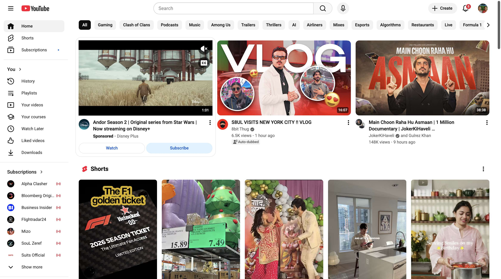
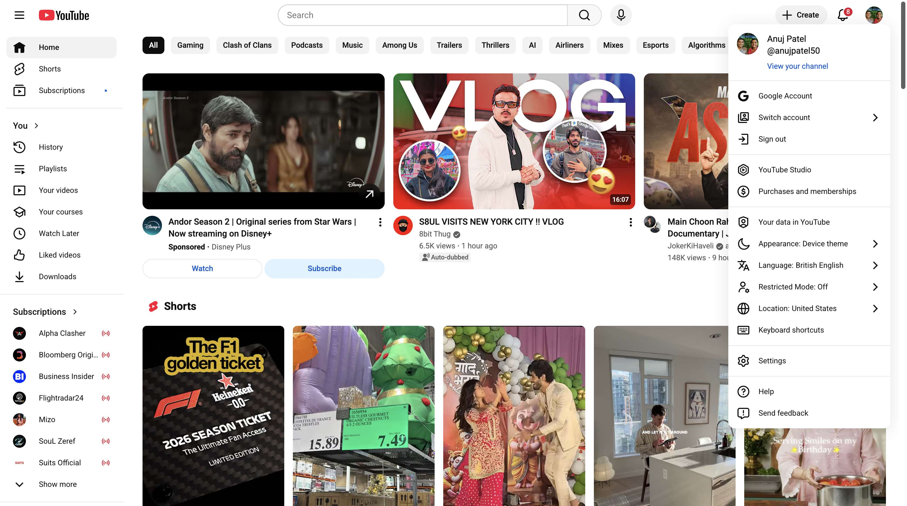
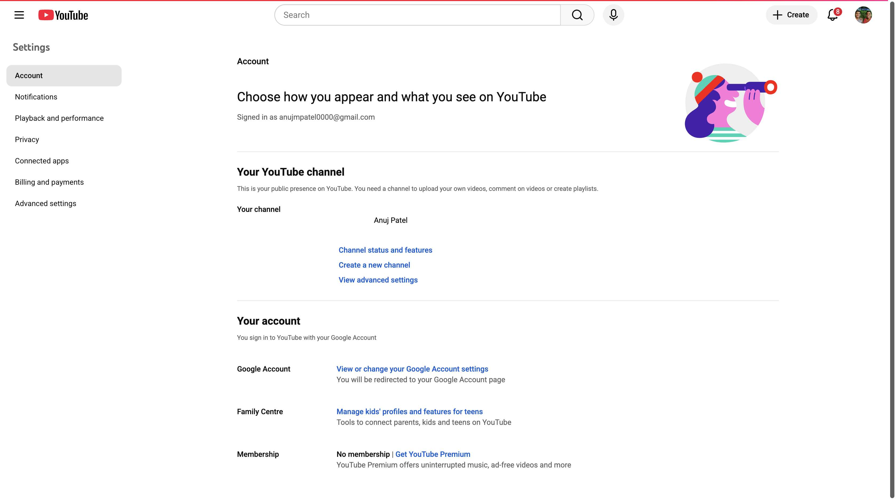

# Change User Settings

**Application:** Youtube

---

## Overview

This guide shows you how to **change user settings** in Youtube through 5 step-by-step screenshots.

## Steps

### 1. Open Youtube.Com',

_🔗 Navigated to https://www.youtube.com_

---

### 2. Wait for Page Load

_Waited for 3 seconds_

---

### 3. Click Button

_Clicked button id=avatar-btn aria-label=Account menu_

---

### 4. Click Element

_Clicked a role=link "Settings" id=endpoint_

---

### 5. Navigate to Page

_Successfully navigated to the YouTube user settings page._

---

## Metadata

- **Captured:** 2025-11-17T09:49:29.062526
- **Total States:** 5
- **App:** youtube

