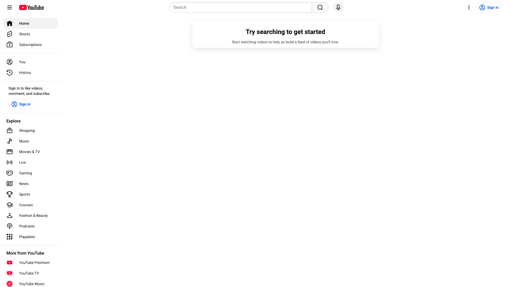

# Find Python Tutorials

## Task Query
find Python tutorials

## Application
Youtube

## Workflow Steps

This workflow captures 2 distinct UI states:

### Step 1: YouTube homepage with a search bar at the top center.

**Action:** type

**Reasoning:** To find Python tutorials, we need to enter the search term in the search bar.

---

### Step 2: Search results for 'Python tutorials' are displayed, showing various video options.

**Action:** complete

**Reasoning:** The search results for 'Python tutorials' are visible on the screen, fulfilling the task goal.

---

## Metadata

- **Captured:** 2025-11-13T16:02:07.296509
- **Total States:** 2
- **App:** youtube

