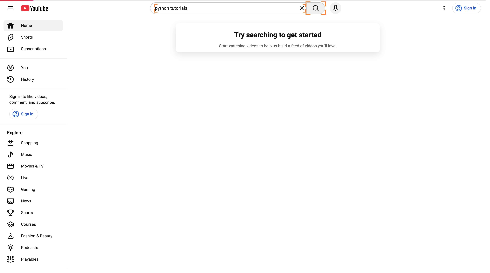
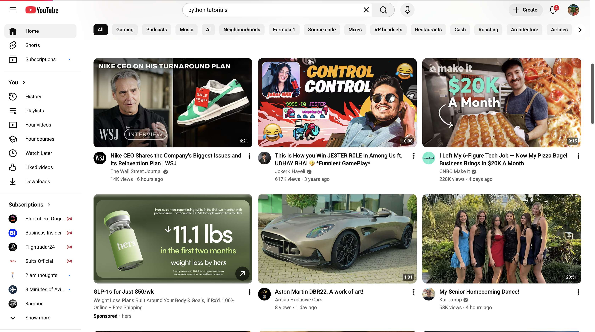

# Search For Python Tutorials

## Task Query
search for python tutorials

## Application
Youtube

## Workflow Steps

This workflow captures 5 distinct UI states:

### Step 1: BrowserStateHistory(url='https://www.youtube.com', title='Initial Actions', tabs=[], interacted_element=[None], screenshot_path=None)

**Action:** [ActionResult(is_done=False, success=None, error=None, attachments=None, long_term_memory='Found initial url and automatically loaded it. Navigated to https://www.youtube.com', extracted_content='🔗 Navigated to https://www.youtube.com', include_extracted_content_only_once=False, metadata=None, include_in_memory=False)]

---

### Step 2: BrowserStateHistory(url='https://www.youtube.com/', title='YouTube', tabs=[TabInfo(url='https://www.youtube.com/', title='YouTube', target_id='9C90CAE2BC36053002E0F332327A6122', parent_target_id=None)], interacted_element=[None], screenshot_path='/var/folders/g1/573ndn_10n1725bppbrkwyfr0000gn/T/browser_use_agent_06919024-a942-781b-8000-180b033a5a50_1763246666/screenshots/step_1.png')

**Action:** [ActionResult(is_done=False, success=None, error=None, attachments=None, long_term_memory='Waited for 3 seconds', extracted_content='Waited for 3 seconds', include_extracted_content_only_once=False, metadata=None, include_in_memory=False)]

---

### Step 3: BrowserStateHistory(url='https://www.youtube.com/', title='(4) YouTube', tabs=[TabInfo(url='https://www.youtube.com/', title='(4) YouTube', target_id='9C90CAE2BC36053002E0F332327A6122', parent_target_id=None)], interacted_element=[DOMInteractedElement(node_id=1020, backend_node_id=1299, frame_id=None, node_type=<NodeType.ELEMENT_NODE: 1>, node_value='', node_name='INPUT', attributes={'class': 'ytSearchboxComponentInput yt-searchbox-input title', 'name': 'search_query', 'aria-controls': 'i0', 'aria-expanded': 'true', 'type': 'text', 'autocomplete': 'off', 'autocorrect': 'off', 'spellcheck': 'false', 'aria-autocomplete': 'list', 'role': 'combobox', 'placeholder': 'Search'}, bounds=DOMRect(x=531.5, y=16.0, width=515.0, height=24.0), x_path='html/body/ytd-app/div[1]/div[2]/ytd-masthead/div[4]/div[2]/yt-searchbox/div[1]/form/input', element_hash=16582232440957797), DOMInteractedElement(node_id=1025, backend_node_id=1304, frame_id=None, node_type=<NodeType.ELEMENT_NODE: 1>, node_value='', node_name='BUTTON', attributes={'aria-label': 'Search', 'class': 'ytSearchboxComponentSearchButton', 'title': 'Search'}, bounds=DOMRect(x=1050.5, y=8.0, width=64.0, height=40.0), x_path='html/body/ytd-app/div[1]/div[2]/ytd-masthead/div[4]/div[2]/yt-searchbox/button', element_hash=991816672843712962)], screenshot_path='/var/folders/g1/573ndn_10n1725bppbrkwyfr0000gn/T/browser_use_agent_06919024-a942-781b-8000-180b033a5a50_1763246666/screenshots/step_2.png')

**Action:** [ActionResult(is_done=False, success=None, error=None, attachments=None, long_term_memory="Typed 'python tutorials'", extracted_content="Typed 'python tutorials'", include_extracted_content_only_once=False, metadata={'input_x': 789.0, 'input_y': 28.0}, include_in_memory=False), ActionResult(is_done=False, success=None, error=None, attachments=None, long_term_memory=None, extracted_content='Clicked button aria-label=Search', include_extracted_content_only_once=False, metadata={'click_x': 1082.5, 'click_y': 28.0}, include_in_memory=False)]

---

### Step 4: BrowserStateHistory(url='https://www.youtube.com/results?search_query=python+tutorials', title='(4) YouTube', tabs=[TabInfo(url='https://www.youtube.com/results?search_query=python+tutorials', title='(4) YouTube', target_id='9C90CAE2BC36053002E0F332327A6122', parent_target_id=None)], interacted_element=[None], screenshot_path='/var/folders/g1/573ndn_10n1725bppbrkwyfr0000gn/T/browser_use_agent_06919024-a942-781b-8000-180b033a5a50_1763246666/screenshots/step_3.png')

**Action:** [ActionResult(is_done=False, success=None, error=None, attachments=None, long_term_memory='Scrolled down 938px', extracted_content='🔍 Scrolled down 938px', include_extracted_content_only_once=False, metadata=None, include_in_memory=False)]

---

### Step 5: BrowserStateHistory(url='https://www.youtube.com/results?search_query=python+tutorials', title='(4) python tutorials - YouTube', tabs=[TabInfo(url='https://www.youtube.com/results?search_query=python+tutorials', title='(4) python tutorials - YouTube', target_id='9C90CAE2BC36053002E0F332327A6122', parent_target_id=None)], interacted_element=[None], screenshot_path='/var/folders/g1/573ndn_10n1725bppbrkwyfr0000gn/T/browser_use_agent_06919024-a942-781b-8000-180b033a5a50_1763246666/screenshots/step_4.png')

**Action:** [ActionResult(is_done=True, success=True, error=None, attachments=[], long_term_memory="Task completed: True - Successfully navigated to YouTube, searched for 'python tutorials', and verified that relevant searc - 34 more characters", extracted_content="Successfully navigated to YouTube, searched for 'python tutorials', and verified that relevant search results are visible on the page.", include_extracted_content_only_once=False, metadata=None, include_in_memory=False)]

---

## Metadata

- **Captured:** 2025-11-15T17:44:41.390441
- **Total States:** 5
- **App:** youtube

